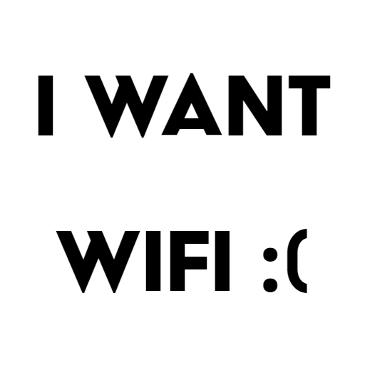

<h1 align="center">

 
I Want Internet
 
</h1>

## NOTICE
> :warning: :warning: :warning: **WARNING:** This project is no longer maintained; there may be bugs and issues. Feel free to fork this repository, pull requests *may* be accepted. :warning: :warning: :warning:

**Oh no, internet out???** -
Get `I WANT INTERNET`, we stress the fact that you want Internet™ and this irritation is a result of withdrawal. We strongly believe that Internet™ is not a need, rather, it is a want.

**How to Download I WANT INTERNET?**
1. Head over to [[Releases]](https://github.com/itsmarsss/I-WANT-INTERNET/releases) and look for the latest version
2. Download `IWANTINTERNET.jar`

**How to use I WANT INTERNET?**

*Make sure you have Java installed on your computer, safe source to [[download]](https://www.oracle.com/java/technologies/downloads/) Java*
1. Click on `IWANTINTERNET.jar` as fast as you can
2. Input an IP or web address, strictly without `https://` or `http://` (use the "bald" address; eg. `www.google.com`)
3. Normally keep it as default (`8.8.8.8` / `www.google.com`) unless you know what you're doing
4. Check `Notify Me` so you get an annoying Windows notification when Internet™ connection is made
5. Right-click on Tray-Icon for options (Windows only - Default located at right side of taskbar in the upwards arrow)